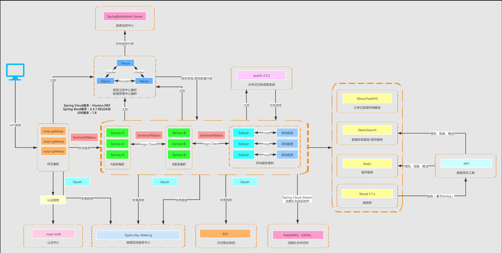
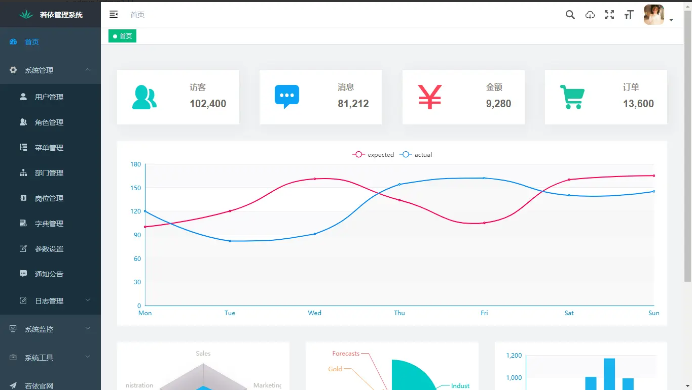
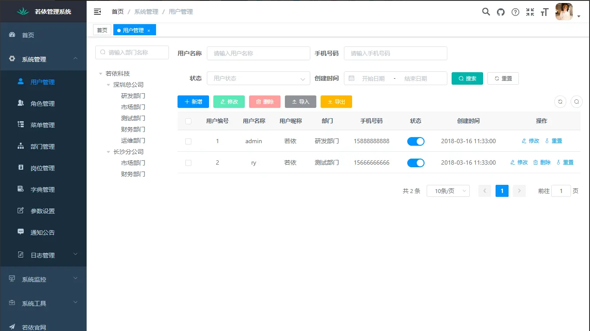

# Athena-RuoYi

本项目主要介绍构建athena-ruoyi项目生产云部署工作，后期将全部服务完整上云。
该仓库同时为后期大规模服务上云以及灰度发布等功能进行演习与测试。

-----------------------------------------------------------------------------------------------
其他平台将同步更新

- Github：https://github.com/2462612540
- Gitee：https://gitee.com/xjl2462612540
- CSDN：https://blog.csdn.net/weixin_41605937?spm=1001.2014.3001.5343

<mark>**整理不易，还望各位看官一键三连 :heart: :heart: :heart: </mark>

<mark>**整理不易，还望各位看官一键三连 :heart: :heart: :heart: **</mark>

-----------------------------------------------------------------------------------------------

# 一、Xmind

# 

# Project Summary
