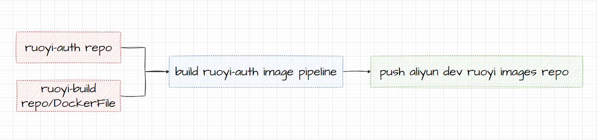

# Athena-RuoYi

本项目主要介绍构建athena-ruoyi项目生产云部署工作，后期将全部服务完整上云。
该仓库同时为后期大规模服务上云以及灰度发布等功能进行演习与测试。

**特别注意该仓库的代码是ruoyi-1.3.0版本**
[ruoyi的研究文档](http://doc.ruoyi.vip/ruoyi-cloud/document/hjbs.html#%E5%90%8E%E7%AB%AF%E8%BF%90%E8%A1%8C)

-----

**其他平台将同步更新**

- Github：https://github.com/2462612540
- Gitee：https://gitee.com/xjl2462612540
- CSDN：https://blog.csdn.net/weixin_41605937?spm=1001.2014.3001.5343

---
**需要完成的工作**
1. 前端课程计划，前端重构页面和添加新的页面，同时调用后端。修改ruoyi系统的全部页面，同时调整ruoyi的相关目录结构。
2. nacos 与mysql的配置关系。对应版本的关系。怎么构建nacos 集群来实现配置。
3. ruoyi后端系统的代码重构，按照标准的微服务项目结构进行解析和部署工作，构建属于自己的项目架构。
4. ruoyi在docker-compose的部署工作。
5. ruoyi的build工作。
6. 
---

# 一、Xmind

## 1.1 ruoyi-arch


## 1.2 ruoyi-system 


# 二、Athena-RuoYi的微服务系统

```
com.ruoyi     
├── ruoyi-ui                                          // 前端框架 [80]
├── ruoyi-gateway                                     // 网关模块 [8080]
├── ruoyi-auth                                        // 认证中心 [9200]
├── ruoyi-api                                         // 接口模块
│       └── ruoyi-api-system                          // 系统接口
├── ruoyi-common                                      // 通用模块
│       └── ruoyi-common-core                         // 核心模块
│       └── ruoyi-common-datascope                    // 权限范围
│       └── ruoyi-common-datasource                   // 多数据源
│       └── ruoyi-common-log                          // 日志记录
│       └── ruoyi-common-redis                        // 缓存服务
│       └── ruoyi-common-seata                        // 分布式事务
│       └── ruoyi-common-security                     // 安全模块
│       └── ruoyi-common-swagger                      // 系统接口
├── ruoyi-modules                                     // 业务模块
│       └── ruoyi-system                              // 系统模块 [9201]
│       └── ruoyi-gen                                 // 代码生成 [9202]
│       └── ruoyi-job                                 // 定时任务 [9203]
│       └── ruoyi-file                                // 文件服务 [9300]
├── ruoyi-visual                                      // 图形化管理模块
│       └── ruoyi-visual-monitor                      // 监控中心 [9100]
├──pom.xml                                            // 公共依赖
```

# 三、Athena-RuoYi 阿里云仓库

```
开发仓库：registry.cn-hangzhou.aliyuncs.com/athena-zhaungxiaoyan/athena-ruoyi-dev
测试仓库：registry.cn-hangzhou.aliyuncs.com/athena-zhaungxiaoyan/athena-ruoyi-test
生产仓库：registry.cn-hangzhou.aliyuncs.com/athena-zhaungxiaoyan/athena-ruoyi-product
```

1. 登录阿里云Docker Registry

```shell
$ docker login --username=18279148786 registry.cn-hangzhou.aliyuncs.com
```

用于登录的用户名为阿里云账号全名，密码为开通服务时设置的密码。 您可以在访问凭证页面修改凭证密码。

2. 从Registry中拉取镜像

```shell
$ docker pull registry.cn-hangzhou.aliyuncs.com/athena-zhaungxiaoyan/athena-ruoyi-product:[镜像版本号]
```

3. 将镜像推送到Registry

```shell
$ docker login --username=18279148786 registry.cn-hangzhou.aliyuncs.com
$ docker tag [ImageId] registry.cn-hangzhou.aliyuncs.com/athena-zhaungxiaoyan/athena-ruoyi-product:[镜像版本号]
$ docker push registry.cn-hangzhou.aliyuncs.com/athena-zhaungxiaoyan/athena-ruoyi-product:[镜像版本号]
```

请根据实际镜像信息替换示例中的[ImageId]和[镜像版本号]参数。

4. 选择合适的镜像仓库地址

从ECS推送镜像时，可以选择使用镜像仓库内网地址。推送速度将得到提升并且将不会损耗您的公网流量。
如果您使用的机器位于VPC网络，请使用 registry-vpc.cn-hangzhou.aliyuncs.com 作为Registry的域名登录。

5. 示例

使用"docker tag"命令重命名镜像，并将它通过专有网络地址推送至Registry。

```shell
$ docker images
REPOSITORY                                                         TAG                 IMAGE ID            CREATED             VIRTUAL SIZE
registry.aliyuncs.com/acs/agent                                    0.7-dfb6816         37bb9c63c8b2        7 days ago          37.89 MB
$ docker tag 37bb9c63c8b2 registry-vpc.cn-hangzhou.aliyuncs.com/acs/agent:0.7-dfb6816
```

使用 "docker push" 命令将该镜像推送至远程。
```shell
$ docker push registry-vpc.cn-hangzhou.aliyuncs.com/acs/agent:0.7-dfb6816
```

# 四、Athena-RuoYi的build系统

```
ruoyi-build-repo    
├── ruoyi-auth-image                                  // ruoyi-auth-image build file
├──────── jar                                              // ruoyi-auth-jar
├──────── DockerFile                                       // ruoyi-auth-image DockerFile
├──────── ruoyi-build-pipeline.groovy                      // ruoyi-auth-build-pipeline.groovy
├── ruoyi-file-image                                  // ruoyi-file-image build file   
├── ruoyi-gateway-image                               // ruoyi-gateway-image build file
├── ruoyi-gen-image                                   // ruoyi-gen-image build file
├── ruoyi-job-image                                   // ruoyi-job-image build file
├── ruoyi-monitor-image                               // ruoyi-monitor-image build file
├── ruoyi-mysql-image                                 // ruoyi-mysql-image build file
├── ruoyi-nacos-image                                 // ruoyi-nacos-image build file
├── ruoyi-nginx-image                                 // ruoyi-nginx-image build file
├── ruoyi-redis-image                                 // ruoyi-redis-image build file
├── ruoyi-system-image                                // ruoyi-system-image build file
```



# 五、Athena-RuoYi的CI/CD系统

```
ruoyi-cicd-repo   
├── cdicd-image                                  // cdicd-image
├── config                                       // config  
├── jobs                                         // jobs
├── pipelines                                    // pipelines
├── resources                                    // resources
├── src                                          // src
├── vars                                         // vars
├── .bumpversion.cfg                             // .bumpversion.cfg 
├── bump-publish-version.sh                      // bump-publish-version.sh
├── JenkinsFile                                  // JenkinsFile 
├── pipeline-pruduct-jobs.groovy                 // pipeline-pruduct-jobs.groovy
├── pipeline-test-jobs.groovy                    // pipeline-test-jobs.groovy
```


# 六、Athena-RuoYi的监控系统


# 七、Athena-RuoYi的Kubenetes与Jenkins系统

## 7.1 k8s集群

## 7.2 jenkins集群

# 八、Athena-RuoYi的自动化部署系统

```
ruoyi-deploy-repo     
├── product                                           // 生产环境部署
│       └── ruoyi-pruduct-deploy-pipeline.groovy          // ruoyi生产环境下的自动部署pipeline 
├── test                                              // 测试环境部署
│       └── ruoyi-test-deploy-pipeline.groovy             // ruoyi测试环境下的自动部署pipeline
├──Jenkins                                            // JenkinsFile
├──README.md                                          // Athena-RuoYi的自动化部署系统说明
```

## 8.1 本地环境部署

```shell
docker run --name ruoyi-mysql -p 3306:3306 --restart=always --privileged=true -e MYSQL_ROOT_PASSWORD=root -d mysql:5.7

docker run --name ruoyi-redis -p 6379:6379 --restart=always --privileged=true -d redis:6.2

docker run --name ruoyi-nacos -p 8848:8848 -p 9848:9848 -p 9849:9849 --restart=always --privileged=true -e JVM_XMS=256m -e JVM_XMX=256m -e MODE=standalone -v /home/xjl/Downloads/docker/nacos/logs:/home/nacos/logs -v /home/xjl/Downloads/docker/nacos/init.d/custom.properties:/home/nacos/init.d/custom.properties  -d nacos/nacos-server:1.3.1
```


# Project Summary