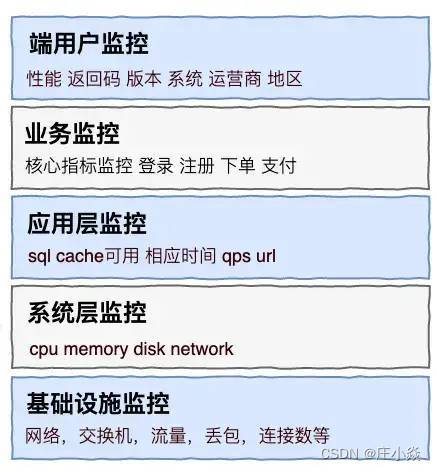
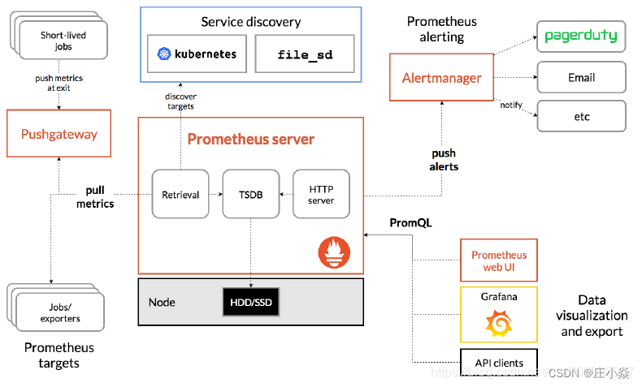

# ruoyi-monitor-repo

# 摘要

监控是微服务治理的一个重要环节，监控系统的完善程度直接影响到我们微服务质量的好坏，我们的微服务在线上运行时，有没有一套完善的监控体系能去了解到它的健康情况，这对整个系统的可靠性和稳定性非常重要。

# 一、微服务监控体系的层级架构

一个比较完善的微服务监控体系需要涉及到哪些层级？如下图所示，大致可以划分为五个层级的监控：
- 最底层基础设施监控：这层一般由运维人员负责，涉及到的方面比较接近硬件体系，例如网络，交换机，路由器等低层设备，
这些设备的可靠性稳定性就直接影响到上层服务应用的稳定性，所以需要对网络的流量，丢包情况、错包情况，连接数等等这些基础设施的核心指标进行监控。
- 系统层监控：这层涵盖了物理机、虚拟机、操作系统等，这些都是属于系统级别监控的方面，主要对几个核心指标进行监控，如cpu使用率、内存占用率，
磁盘IO和网络带宽情况。
- 应用层监控：这层涉及到方面和服务紧密相关，例如对url访问的性能，访问的调用数，访问的延迟，还有对服务提供性能进行监控，服务的错误率等，
同时对sql也需要进行监控，查看是否有慢sql。对于cache来说，需要监控缓存的命中率和性能，每个服务的响应时间和qps等等。
- 业务监控：业务监控具体指什么？举个例子，比如说一个典型的交易网站，需要关注它的用户登录情况、注册情况、下单情况、支付情况等等，
这些直接影响到实际触发的业务交易情况，这层监控可以提供给运营和公司高管们，提供他们需要关注的数据，直接以数据支撑公司在战略层面的决策和方向。
- 端用户体验监控：一个应用程序可能通过app、h5、pc端的方式交付到用户的手上，用户通过浏览器，客户端打开连到我们的服务，
那么在用户端，用户的体验是怎么样？用户端的性能是怎么样？以及有没有产生错误等等……这些信息都需要进行监控并记录下来，如果没有监控，有可能因为某些BUG或者性能问题，造成用户体验非常差，而我们并没有感知。其中包括监控用户端的使用性能、返回码，在哪些城市地区，他们的使用情况是怎么样，还有运营商的情况，包括三大运营商不同用户的连接情况。我们需要进一步知道，是否有哪些渠道哪些用户接入的时候存在着问题，我们还需要知道客户端使用的操作系统浏览器的版本。

总结：这就是我们体系化的监控分层，每一个层级都非常重要。一般情况下，当一个问题出现时，较大概率会先暴露在用户端或业务层，比如说，我们的订单量下降了，业务人员和开发人员会先从上到下去逐层检查是在哪里出现了问题，先确定是否哪个接口调用比较慢，哪个服务调用出现延时，再看是否哪个机器负载过高了，然后再进一步往下一个层去看，是否是网络调用不稳定导致。所以，一个好的监控体系，在每个层级都非常重要。

# 二、微服务监控系统设计要点

微服务监控系统设计要点可以分为以下六个点：

- 日志监控
- Metrics监控
- 调用链监控
- 报警系统
- 健康检查
- 异常处理服务

在微服务运行的体系下，我们一般把监控的agent分散到各个服务身边，agent分别是收集机器和服务的metrics，发送到后台监控系统，
一般来说，我们的服务量非常大，在收集的过程中，会加入队列。一般来说用kafka等消息队列有个好处，两边可以进行解耦，
可以起到庞大的日志进行一个缓存的地带，并且可以做到高可用，保证消息不会丢失。

日志收集目前比较流行的是ELK的一套解决方案（Elasticsearch，Logstash，Kibana），Elasticsearch 分布式搜索引擎，
Logstash 是一个日志收集的agent，Kibana 是一个查询的日志界面。metrice会采用一个时间序列的数据库，influxDB是最近比较主流时间数据库。

微服务的agent例如springboot也提供了健康检查的端点，可以检查cpu使用情况、内存使用情况、jvm使用情况，这些需要一个健康检查机制，
能够定期对服务的健康和机器的健康进行check，比较常见的是nagios、zabbix等，这些开源平台能够定期去检查到各个微服务的检查程序并能够进行告警给相关人员，
在服务未崩溃之前就可以进行提前的预先接入。

# 三、基于时间序列数据库的开源监控方案

## 3.1 基于Promethes的开源监控

Promethes是一款2012年开源的监控框架，其本质是时间序列数据库，由Google前员工所开发。
Promethes采用拉的模式（Pull）从应用中拉取数据，并还支持 Alert 模块可以实现监控预警。它的性能非常强劲，单机可以消费百万级时间序列。架构如下：



### 3.1.1 Prometheus 主要包含下面几个组件：
- Prometheus Server：用于拉取 metrics 信息并将数据存储在时间序列数据库。
- Jobs/exporters：用于暴露已有的第三方服务的 metrics 给 Prometheus Server，比如StatsD、Graphite 等，负责数据收集。
- Pushgateway：主要用于短期 jobs，由于这类 jobs 存在时间短，可能在 PrometheusServer 来拉取 metrics 信息之前就消失了，所以这类的 jobs 可以直接向 PrometheusServer 推送它们的 metrics 信息。
- Alertmanager：用于数据报警。
- Prometheus web UI：负责数据展示。

### 3.1.2 Prometheus工作流程：
- Prometheus Server 定期从配置好的 jobs 或者 exporters 中拉取 metrics 信息，或者接收来自 Pushgateway 发过来的 metrics 信息。
- Prometheus Server 把收集到的 metrics 信息存储到时间序列数据库中，并运行已经定义好的 alert.rules，向 Alertmanager 推送警报。
- Alertmanager 根据配置文件，对接收的警报进行处理，发出告警。
- 通过 Prometheus web UI 进行可视化展示。

## 3.2 基于Promethes的开源监控实战

如果要想监控，前提是能获取被监控端指标数据，并且这个数据格式必须遵循Prometheus数据模型，这样才能识别和采集，
一般使用exporter提供监控指标数据。Exporter是Prometheus的一类数据采集组件的总称。它负责从目标处搜集数据，
并将其转化为Prometheus支持的格式。与传统的数据采集组件不同的是，它并不向中央服务器发送数据，而是等待中央服务器主动前来抓取。

### 3.2.1 系统层监控node exporter
Node Exporter 是用于暴露主机指标的 Exporter，比如采集 CPU、内存、磁盘等信息。采用 Go 编写，不存在任何第三方依赖，
所以只需要下载解压即可运行。 Node-exporter用于采集服务器层面的运行指标，包括机器的loadavg、filesystem、meminfo等基础监控，
类似于传统主机监控维度的zabbix-agent。

node_exporter：用于监控Linux系统的指标采集器。常用指标：

- CPU
- 内存
- 硬盘
- 网络流量
- 文件描述符
- 系统负载
- 系统服务
- 
```bash
1. 在节点上执行命令下载

wget "https://github.com/prometheus/node_exporter/releases/download/v1.5.0/node_exporter-1.5.0.linux-amd64.tar.gz"

2. 解压压缩包

tar -xvf node_exporter-1.5.0.linux-amd64.tar.gz

3. 将node_exporter-1.5.0.linux-amd64目录下的 node_exporter二进制文件复制到 /usr/local/bin路径下

cp node_exporter  /usr/local/bin/


4. 重载系统systemd配置

systemctl daemon-reload

5. 启动服务并且设置服务自启

[root@master node_exporter]# systemctl enable --now node_exporter
Created symlink from /etc/systemd/system/multi-user.target.wants/node_exporter.service to /etc/systemd/system/node_exporter.service.

6. 查看服务运行状态

systemctl status node_exporter
● node_exporter.service - node_exporter
Loaded: loaded (/etc/systemd/system/node_exporter.service; enabled; vendor preset: disabled)
Active: active (running) since Mon 2023-01-30 11:02:34 CST; 41s ago
Main PID: 77865 (node_exporter)
CGroup: /system.slice/node_exporter.service
└─77865 /usr/local/bin/node_exporter --web.listen-address=:9100 --collector.systemd --collector.systemd.unit-whitelist=(sshd|nginx).service --collector.processes --collector.tcpstat

7. 测试接口

curl -s {{节点IP}}:9100/metrics
1. 拉取node export  镜像

docker pull prom/node-exporter
```

```bash
2.部署node export

# 启动node-exporter
docker run -d --name node-exporter --restart=always -p 9100:9100 -v "/proc:/host/proc:ro" -v "/sys:/host/sys:ro" -v "/:/rootfs:ro" prom/node-exporter

3. 查询是否运行正常

docker ps

或者查询端口是否被监听

lsos -i:9100

4. 测试node export服务

访问页面浏览器输入http://ip:9100/metrics

查看服务器是否有数据收集
```

### 3.2.2 时序数据库Prometheus

Prometheus 本身不具备收集监控数据功能，需要使用 http 接口来获取不同的 export 收集的数据，存储到时序数据库中。
```bash
1. 拉取prometheus镜像

docker pull prom/prometheus

2. 配置prometheus文件

docker run -itd --name docker_prometheus prom/prometheus

# 复制容器内部的配置文件到宿主机，不用事先创建$PWD/prometheus目录（后续的配置主要在该目录下展开，因此一定要拉到本地）

docker cp -a docker_prometheus:/etc/prometheus/ $PWD/prometheus

# 删除容器

docker rm -f docker_prometheus

3. 运行prometheus服务

# 启动容器 设置端口

docker run -itd --name docker_prometheus --restart=always -p 9090:9090 -v $PWD/prometheus:/etc/prometheus/ prom/prometheus


4. 查询prometheus状态

docker ps ｜ grep docker_prometheus

浏览器输入http://ip:9090/targets进入页面
# 此片段指定的是prometheus的全局配置， 比如采集间隔，抓取超时时间等.
global:
# 抓取间隔
[ scrape_interval: <duration> | default = 1m ]

# 抓取超时时间
[ scrape_timeout: <duration> | default = 10s ]

# 评估规则间隔
[ evaluation_interval: <duration> | default = 1m ]

# 外部一些标签设置
external_labels:
[ <labelname>: <labelvalue> ... ]

# File to which PromQL queries are logged.
# Reloading the configuration will reopen the file.
[ query_log_file: <string> ]

# 此片段指定报警规则文件， prometheus根据这些规则信息，会推送报警信息到alertmanager中。
rule_files:
[ - <filepath_glob> ... ]

# 此片段指定抓取配置，prometheus的数据采集通过此片段配置。
scrape_configs:
[ - <scrape_config> ... ]

# 此片段指定报警配置， 这里主要是指定prometheus将报警规则推送到指定的alertmanager实例地址。
alerting:
alert_relabel_configs:
[ - <relabel_config> ... ]
alertmanagers:
[ - <alertmanager_config> ... ]

# 指定后端的存储的写入api地址。
remote_write:
[ - <remote_write> ... ]

# 指定后端的存储的读取api地址。
remote_read:
[ - <remote_read> ... ]
```

### 3.2.3 Grafana部署数据展示
```bash
# 启动grafana
docker run -itd --name grafana grafana/grafana

# 复制容器内部的配置文件到宿主机，不用事先创建$PWD/prometheus目录
docker cp -a grafana:/var/lib/grafana $PWD/grafana-storage

# 删除容器
docker rm -f grafana

# 添加目录权限（不添加权限不够，容器无法启动）
chmod -R 777 grafana-storage

# 启动容器 设置端口
docker run -itd --name=grafana --restart=always -p 3000:3000 -v $PWD/grafana-storage:/var/lib/grafana grafana/grafana


登录granfana 用户名密码默认为admin

设置–数据源–添加数据源

选择Prometheus并添加http://ip:9090

选择数据展示模版，添加模版
```

### 3.2.4 Alertmanager 告警通知系统

创建Alertmanager配置文件：使用K8S部署的方式，先创建一个ConfigMap 资源对象用于管理Alertmanager的配置文件,在Alertmanager配置文件中配置全局参数、邮件信息、分发路由、接收者等，如下为ConfigMap资源定义：
```bash
global:					#全局配置：指定所有其他配置上下文中有效的参数，作为其他配置部分的默认值
resolve_timeout: 5m		#alertmanager持续多长时间未接收到告警后标记告警状态为 resolved
以下配置邮件发送信息
smtp_smarthost: 'smtp.163.com:465'       #发送邮件的SMTP主机
smtp_from: 'yrnhhh@163.com'              #邮箱地址
smtp_auth_username: 'yhhh@163.com'       #邮箱地址,登录用户
smtp_auth_password: 'XXXXXXXXXXXXXXXX'   #授权码
smtp_hello: '163.com'					 #识别SMTP服务器的默认主机名
smtp_require_tls: false					 #是否加密连接

route 					                 #配置分发路由
group_by: ['alertname', 'cluster']       #这里标签列表用于分组，同标签值会被聚合到一个分组里
group_wait: 30s							 #初始化通知
group_interval: 30s						 #相同的group之间发送告警通知的时间间隔
repeat_interval: 1h						 #如果一个报警信息已发送成功，等待重新发送他们的时间
receiver: default						 #默认接收器，如报警没有被route匹配，则会发送给默认的接收器
routes:									 #上面所有的属性都由所有子路由继承，并且可以在每个子路由上进行覆盖
- receiver: email
  group_wait: 10s
  match:
  team: node
  receivers:								 #定义告警邮件接收者
- name: 'default'
  email_configs:
    - to: '1234567890@qq.com'
      send_resolved: true					 #接受告警恢复的通知
- name: 'email'
  email_configs:
    - to: '0987654321@qq.com'
      send_resolved: true
      promethues配置与Alertmanager关联，AlertManager 的容器启动起来后，需要在 Prometheus 中配置下 AlertManager 的地址，让 Prometheus 能够访问到 AlertManager，在 Prometheus 的 ConfigMap 资源清单中添加如下配置并重新加载Prometheus配置文件：

alerting:
alertmanagers:
- static_configs:
    - targets: ["alertmanager:9093"]
      在Prometheus 配置中添加报警规则配置，配置文件中 rule_files 就是用来指定报警规则文件的，如下配置即指定存放报警规则的目录为/etc/prometheus，规则文件为rules.yml：

rule_files:
- /etc/prometheus/rules.yml
  设置报警规则：警报规则允许基于 Prometheus 表达式语言的表达式来定义报警报条件的，并在触发警报时发送通知给外部的接收者（Alertmanager），一条警报规则主要由以下几部分组成：

alert 告警规则的名称
expr 是用于进行报警规则 PromQL 查询语句
for 评估告警的等待时间（Pending Duration）
labels 自定义标签，允许用户指定额外的标签列表，把它们附加在告警上
annotations 用于存储一些额外的信息，用于报警信息的展示之类的

rules.yml如下所示：这里配置了两条告警规则：

    groups:
    - name: Node_Metrics
      rules:
       - alert: Node_Filesystem_Below_20GB
         expr: sum(node_filesystem_avail_bytes)by(instance)/1024/1024/1024 < 20
         for: 2m
         labels:
           team: node
         annotations:
          summary: "{{$labels.instance}}: Filesystem Pressure"
          description: "{{$labels.instance}}: Filesystem is below 20GB"
       - alert: Node_MemoryUsage_Above_80%
         expr: (node_memory_MemTotal_bytes - (node_memory_MemFree_bytes + node_memory_Buffers_bytes + node_memory_Cached_bytes)) / node_memory_MemTotal_bytes * 100 > 86
         for: 2m
         labels:
           team: node
         annotations:
           summary: "{{$labels.instance}}: High Memory usage detected"
           description: "{{$labels.instance}}: Memory usage is above 86% (current value is: {{ $value }}"


如上设置有两条报警规则：
1、文件系统可用空间小于20GB即触发警报：
sum(node_filesystem_avail_bytes)by(instance)/1024/1024/1024 < 20
2、内存使用率大于86%即触发警报
(node_memory_MemTotal_bytes - (node_memory_MemFree_bytes + node_memory_Buffers_bytes + node_memory_Cached_bytes)) / node_memory_MemTotal_bytes * 100 > 86
其中alerts中有3种状态：
同样可以通过 NodePort 的形式去访问 AlertManager 的 Dashboard 页面，也可以查看到报警信息，正常来说这个时候也会收到一封报警邮件（使用Alertmanager系统自带的默认通知模板）
```

# 四、集中式日志解决方案

## 4.1 基于ELK集中式监控系统

ELK是Elasticsearch、Logstash、kibana三个开源软件产品首字母的缩写，它们三个通常配合使用，所以被称为ELK Stack。三个组件的功能各不相同：

- Logstash：负责数据收集和传输，它支持动态地从各种数据收集数据，并对数据进行过滤、分析、格式化等，然后存储到指定的位置。
- Elasticsearch：负责数据处理，它是一个开源分布式搜索和分析引擎，具有可伸缩、高可靠和易管理等特点，基于Apache Lucene构建，能对大容量的数据进行接近实时的存储、搜索和分析操作，通常被用作基础搜索引擎。
- Kibana负责数据展示，也是一个开源和免费的工具，通常和Elasticsearch搭配使用，对其中的数据进行搜索、分析并且以图标的方式展示。
这种架构因为需要在各个服务器上部署Logstash来从不同的数据源收集数据，所以比较小号CPU和内存资源，容易造成服务器性能下降，因此后来又在Elasticsearch、Logstash、Kibana之外引入了Beats作为数据收集器。相比于Logstash，Beats所占系统的CPU和内存几乎可以忽略不计，可以安装在每台服务器上做轻量型代理，从成百上千或成千上万太机器向Logstash或者直接向Elasticsearch发送数据。

其中Beats支持多种数据源，主要包括：

- Packetbeat，用来是收集网络流量数据。
- Topbeat，用来收集系统、进程的CPU和内存使用情况等数据。
- Filebeat，用来收集文件数据。
- Winlogbeat，用来收集Windows事件日志数据。

## 4.2 基于TICK的集中式监控系统

TICK 是 Telegraf、InfluxDB、Chronograf、Kapacitor 四个软件首字母的缩写，是由InfluxData 开发的一套开源监控工具栈， 因此也叫作 TICK Stack.


其中 Telegraf 负责数据收集，InfluxDB 负责数据存储，Chronograf负责数据展示，Kapacitor 负责数据告警。

## 4.3 基于Graphite的集中式监控系统

Graphite的组成主要包括三部分：Carbon、Whisper、Graphite-Web。

- Carbon:主要作用是接受被监控节点的连接，收集各个指标的数据，将这些数据写入carbon-cache并最终持久到Whisper存储文件中去。

- Whisper：一个简单的时序数据库，主要作用是存储时间序列数据，可以按照不同的时间粒度来存储数据，比如1分钟1个点、5分钟1个点、15分钟1个点三个精度来存储监控数据。

- Graphite-Web：一个Web App，其主要功能绘制报表与展示，即数据展示。为了保证Graphite-Web能及时绘制出图形，Carbon在将数据写入Whisper存储的同时，会在carbon-cache中同时写入一份数据，Graphite-Web会先查询carbon-cache，如果没有再查询Whisper存储。

- Carbon 对写入的数据格式有一定的要求：

servers.www01.cpuUsage 42 1286269200
products.snake-oil.salesPerMinute 123 1286269200
[one minute passes]
servers.www01.cpuUsageUser 44 1286269260
products.snake-oil.salesPerMinute 119 1286269260

# 五、监控选型对比

**数据收集对比**

ELK 是 Beats 采集的数据传输给 Logstash，经过 Logstash 清洗后再传输给Elasticsearch；
TICK 是Telegraf 采集的数据，传输给 InfluxDB；
而 Prometheus 是 Prometheus Server 隔一段时间定期去从 jobs/exporters 拉取数据。
可见前三种都是采用“推数据”的方式，而Prometheus 是采取拉数据的方式，因此 Prometheus 的解决方案对服务端的侵入最小，不需要在服务端部署数据采集代理。

**数据传输**

ELK 是通过在每台服务器上部署 Beats 代理来采集数据；
TICK 使用了 Telegraf 作为数据采集组件；
Prometheus 通过 jobs/exporters 组件来获取 StatsD 等采集过来的 metrics 信息。

**数据处理**

ELK 可以对日志的任意字段索引，适合多维度的数据查询，在存储时间序列数据方面与时间序列数据库相比会有额外的性能和存储开销。除此之外，时间序列数据库的几种解决方案都支持多种功能的数据查询处理，功能也更强大。
InfluxDB 通过类似 SQL 语言的 InfluxQL，能对监控数据进行复杂操作，比如查询一分钟 CPU 的使用率，用 InfluxDB 实现的示例是：
Prometheus 通过私有的 PromQL 查询语言，如果要和上面 InfluxDB 实现同样的功能，PromQL 语句如下，看起来更加简洁。

**数据展示**

TICK 和 Prometheus 自带的展示功能都比较弱，界面也不好看，不过好在它们都支持Grafana来做数据展示。Grafana 是一个开源的仪表盘工具，它支持多种数据源比如Graphite、InfluxDB、Prometheus 以及 Elasticsearch 等。ELK 采用了 Kibana 做数据展示，Kibana 包含的数据展示功能比较强大，但只支持 Elasticsearch，而且界面展示 UI 效果不如 Grafana 美观。

**监控选型总结**

ELK 的技术栈比较成熟，应用范围也比较广，除了可用作监控系统外，还可以用作日志查询和分析。
Graphite 是基于时间序列数据库存储的监控系统，并且提供了功能强大的各种聚合函数比如sum、average、top5 等可用于监控分析，而且对外提供了 API 也可以接入其他图形化监控系统如Grafana。
TICK 的核心在于其时间序列数据库 InfluxDB 的存储功能强大，且支持类似 SQL 语言的复杂数据处理操作。
Prometheus 的独特之处在于它采用了拉数据的方式，对业务影响较小，同时也采用了时间序列数据库存储，而且支持独有的 PromQL 查询语言，功能强大而且简洁。

**从两个角度考虑**

从对实时性要求角度考虑，时间序列数据库的实时性要好于 ELK，通常可以做到 10s 级别内的延迟，如果对实时性敏感的话，建议选择时间序列数据库解决方案。
从使用的灵活性角度考虑，几种时间序列数据库的监控处理功能都要比 ELK 更加丰富，使用更灵活也更现代化。

# 博文参考
