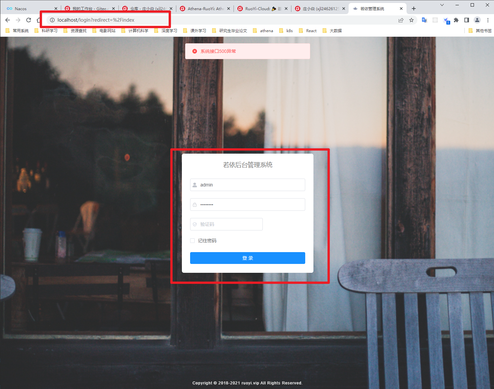

# ruoyi-ui

# 摘要


# ruoyi-ui的环境准备

```
- node16.9
```

# ruoyi-ui安装依赖文件

```bash
# 克隆项目
git clone https://gitee.com/y_project/RuoYi-Vue

# 进入项目目录
cd ruoyi-ui

# 安装依赖
npm install

# 建议不要直接使用 cnpm 安装依赖，会有各种诡异的 bug。可以通过如下操作解决 npm 下载速度慢的问题
npm install --registry=https://registry.npm.taobao.org

# 启动服务
npm run dev
```

# ruoyi-ui 发布命令

```bash
# 构建测试环境
npm run build:stage

# 构建生产环境
npm run build:prod
```

# ruoyi-ui服务访问测试



浏览器访问 http://localhost（机器ip）:80

# 博文参考